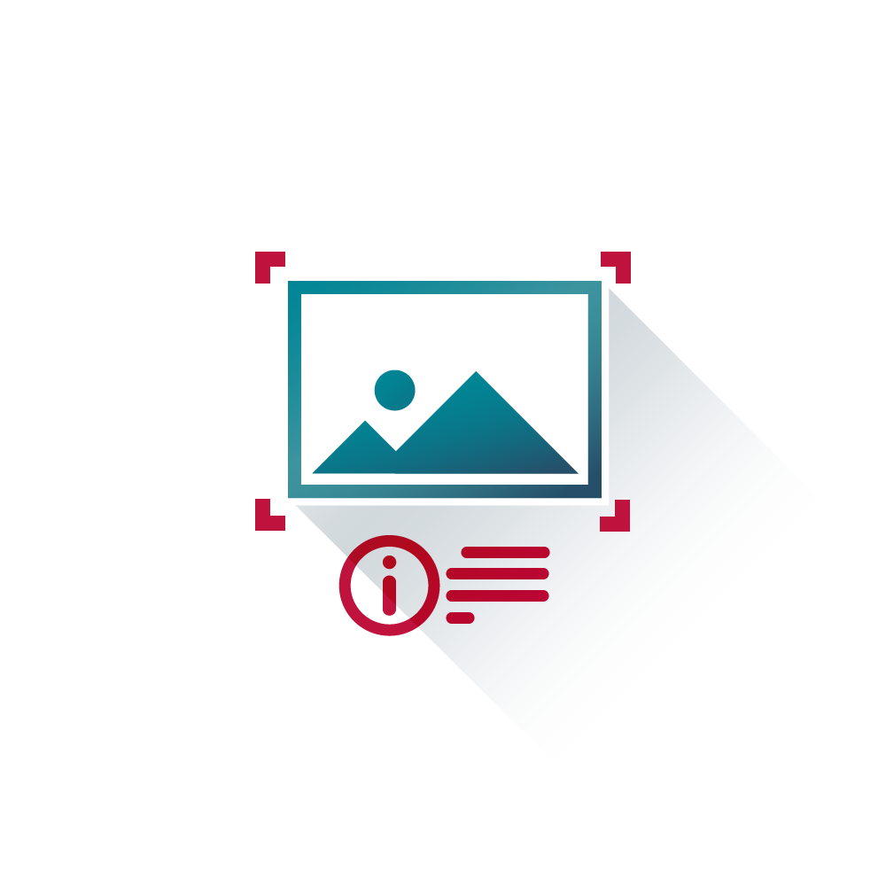

# Delete your custom image classifier for Watson Visual Recognition service

This set of extensions enables you to delete your own custom classifiers.

  

serice demo:
https://visual-recognition-demo.mybluemix.net/train

# Before you start

1. Sign up an IBM Bluemix acount.

	https://console.ng.bluemix.net/registration/?target=%2Fdashboard%2Fapps
	
	or log in to an existing one
	
2. Create new app
	1. In your dashboard click on 'Create App'
	2. Find 'Visual Recognition'
	3. Fill out the form and proceed with 'Create' button
	
3. Aquire service 'api_key'
	1. On your service's main page click 'Service Credentials' tab.
	2. From the list choose your credentials and click on 'View Credentials'
	3. Copy Your 'api_key'.
	

4. SPSS Modeler and R requirements:
	- SPSS Modeler v18.0
	- SPSS Modeler 'R essentials' plugin
	- R packages: 
		- httr
		- RJSONIO
		- RCurl
		
5. Install WatsonDeleteClassifier extension from SPSS Modeler Extension Hub.

# Example usage
## Deleting classifiers

Example stream

  

WatsonCreateClassifier node requires a connected source with your 'api_key' for bluemix services. 

  

	
In the main node window coose your 'api_key' in the 'Watson Api Key' field. Next provide 'Name', 'Class Name' and choose files that contain examples representing your 'Class Name' and some examples representing their opposites.

  

	
	
# Output

The generated output will inform you whether the operation was successful.

  

You can train new classifiers with ['WatsonCreateClassifier'][2] extension!

# License
- [Apache 2.0][1]

# Contributors
- Artur Kucia

 [1]: http://www.apache.org/licenses/LICENSE-2.0.html
 [2]: https://github.com/SpssModelerExtensions/WatsonCreateClassifier
