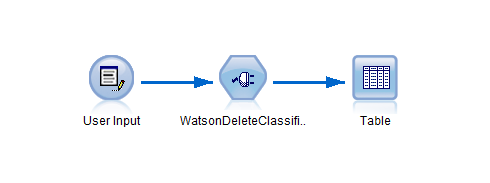
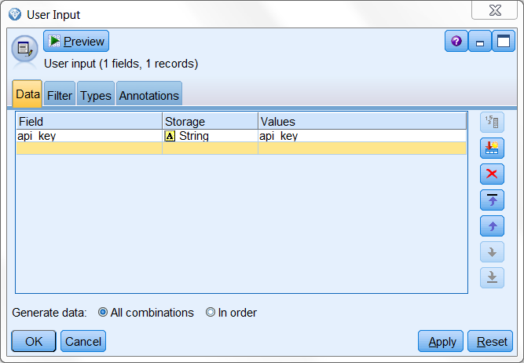
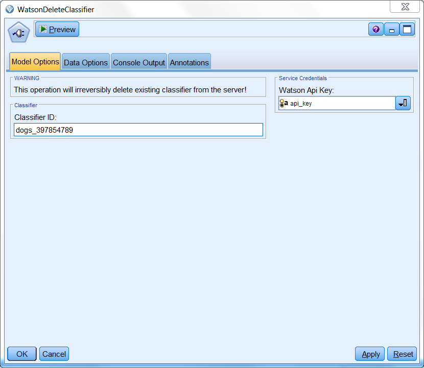
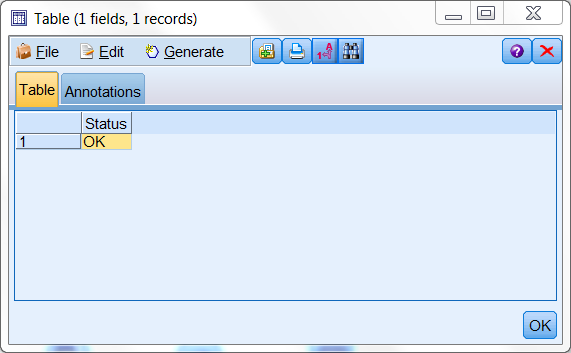

# Delete your custom image classifier for Watson Visual Recognition service

This extensions enables you to delete your custom classifiers.

  

service demo:
https://visual-recognition-demo.mybluemix.net/train

# Before you start

1. Sign up an IBM Bluemix acount.

	https://console.ng.bluemix.net/registration/?target=%2Fdashboard%2Fapps
	
	or log in to an existing one
	
2. Create new app
	1. In your dashboard click on 'Create App'
	2. Find 'Visual Recognition'
	3. Fill out the form and proceed with 'Create' button
	
3. Aquire service 'api_key'
	1. On your service's main page click 'Service Credentials' tab.
	2. From the list choose your credentials and click on 'View Credentials'
	3. Copy Your 'api_key'.
	

4. SPSS Modeler and R requirements:
	- [SPSS Modeler v18.0][4]
	- [SPSS Modeler 'R essentials' plugin][3]
	- R packages: 
		- httr
		- RJSONIO
		- RCurl
		
5. Install WatsonDeleteClassifier extension from SPSS Modeler Extension Hub.

# Example usage

Example stream

  

WatsonDeleteClassifier node requires a connected source with your 'api_key' for bluemix services. 

  

In the WatsonDeleteClassifier's main window provide the id of the classifier and connect the 'api_key' from the 'user input' node.

  

	
	
# Output

The generated output will inform you whether the operation was successful.

  

You can train new classifiers with ['WatsonCreateClassifier'][2] extension!

# License
- [Apache 2.0][1]

# Contributors
- Artur Kucia

 [1]: http://www.apache.org/licenses/LICENSE-2.0.html
 [2]: https://github.com/SpssModelerExtensions/WatsonCreateClassifier
  [3]: http://www.ibm.com/support/knowledgecenter/SS3RA7_18.0.0/modeler_r_plugin_install_project_ddita/clementine/programmability_option/r_essentials_install.html
 [4]: http://www-03.ibm.com/software/products/en/spss-modeler
